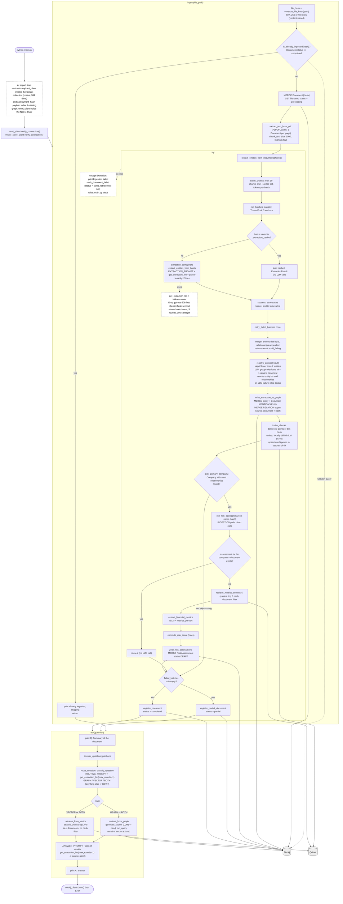

# main.py architecture (Mermaid)

Everything `python main.py` does: connect, ingest one PDF into the graph + vector store + a draft risk score, then answer a question.

```mermaid
flowchart TD
    classDef db fill:#eee,stroke:#333,color:#000
    classDef note fill:#fff,stroke:#999,stroke-dasharray: 4 3,color:#000

    START([python main.py]) --> IMP["At import time:<br/>vectorstore.qdrant_client creates the Qdrant collection (cosine, 384 dims)<br/>and a document_hash payload index if missing<br/>graph.neo4j_client builds the Neo4j driver"]:::note
    IMP --> VER["neo4j_client.verify_connection()<br/>vector_store_client.verify_connection()"]
    VER --> ING

    subgraph ING["ingest(file_path)"]
        direction TB
        I1["file_hash = compute_file_hash(path)<br/>SHA-256 of file bytes (content-based)"]
        I2{"is_already_ingested(hash)?<br/>Document.status == completed"}
        SKIP["print already ingested, skipping<br/>return"]
        I3["MERGE Document {hash}<br/>SET filename, status = processing"]
        I4["extract_text_from_pdf (PyPDFLoader, 1 Document per page)<br/>chunk_text (size 1000, overlap 200)"]

        subgraph TRY["try:"]
            direction TB
            E1["extract_entities_from_document(chunks)"]
            E2["batch_chunks: max 10 chunks and ~15,000 est. tokens per batch"]
            E3["run_batches_parallel: ThreadPool, 3 workers"]
            E4{"batch saved in<br/>.extraction_cache?"}
            E5["load cached ExtractionResult<br/>(no LLM call)"]
            E6["extraction_semaphore<br/>extract_entities_from_batch<br/>EXTRACTION_PROMPT + get_extraction_llm + parser<br/>tenacity: 2 tries"]
            LLM["get_extraction_llm = failover router<br/>Groq gpt-oss-20b first, Gemini flash second<br/>shared cool-downs, 3 rounds, 180 s budget"]:::note
            E7["success: save cache<br/>failure: add to failures list"]
            E8["retry_failed_batches once"]
            E9["merge: entities dict by id, relationships appended<br/>returns result + still_failing"]
            R1["resolve_entities(result)<br/>skip if fewer than 2 entities<br/>LLM groups duplicate ids -> alias to canonical<br/>rewrite entity ids and relationships<br/>on LLM failure: skip dedup"]
            G1["write_extraction_to_graph<br/>MERGE Entity + Document MENTIONS Entity<br/>MERGE RELATION edges (source_document = hash)"]
            V1["index_chunks<br/>delete old points of this hash<br/>embed locally (all-MiniLM-L6-v2)<br/>upsert uuid5 points in batches of 64"]
            P1{"pick_primary_company:<br/>Company with most relationships<br/>found?"}
            K1["run_risk_agent(primary.id, name, hash)<br/>INGESTION path, direct calls"]
            K2{"assessment for this<br/>company + document exists?"}
            K3["reuse it (no LLM call)"]
            K4["retrieve_metrics_context: 5 queries, top 3 each, document filter"]
            K5["extract_financial_metrics (LLM + metrics_parser)"]
            K6["compute_risk_score (rules)"]
            K7["write_risk_assessment: MERGE RiskAssessment status DRAFT"]
            F1{"failed_batches<br/>not empty?"}
            F2["register_partial_document<br/>status = partial"]
            F3["register_document<br/>status = completed"]
            E1 --> E2 --> E3 --> E4
            E4 -- yes --> E5 --> E7
            E4 -- no --> E6 --> E7
            E6 -.uses.-> LLM
            E7 --> E8 --> E9 --> R1 --> G1 --> V1 --> P1
            P1 -- yes --> K1 --> K2
            P1 -- no: skip scoring --> F1
            K2 -- yes --> K3 --> F1
            K2 -- no --> K4 --> K5 --> K6 --> K7 --> F1
            F1 -- yes --> F2
            F1 -- no --> F3
        end
        EXC["except Exception:<br/>print Ingestion failed<br/>mark_document_failed (status = failed, retried next run)<br/>raise: main.py stops"]:::note

        I1 --> I2
        I2 -- yes --> SKIP
        I2 -- no --> I3 --> I4 --> E1
        TRY -.any error.-> EXC
    end

    I2 -.CHECK query.-> NEO[(Neo4j)]:::db
    I3 --> NEO
    G1 --> NEO
    K7 --> NEO
    F2 --> NEO
    F3 --> NEO
    V1 --> QD[(Qdrant)]:::db
    K4 --> QD

    SKIP --> ASK
    F2 --> ASK
    F3 --> ASK

    subgraph ASK["ask(question)"]
        direction TB
        Q0["print Q: Summary of the document"]
        Q1["answer_question(question)"]
        Q2["route_question: classify_question<br/>ROUTING_PROMPT + get_extraction_llm(max_rounds=1)<br/>GRAPH / VECTOR / BOTH (anything else -> BOTH)"]
        Q3{"route"}
        Q4["retrieve_from_graph<br/>generate_cypher (LLM) -> neo4j run_query<br/>result or error captured"]
        Q5["retrieve_from_vector<br/>search_chunks top_k=5<br/>ALL documents, no hash filter"]
        Q6["ANSWER_PROMPT + json of results<br/>get_extraction_llm(max_rounds=1) -> answer.strip()"]
        Q7["print A: answer"]
        Q0 --> Q1 --> Q2 --> Q3
        Q3 -- GRAPH or BOTH --> Q4 --> Q6
        Q3 -- VECTOR or BOTH --> Q5 --> Q6
        Q6 --> Q7
    end
    Q4 --> NEO
    Q5 --> QD
    Q7 --> END(["neo4j_client.close() then END"])
```
